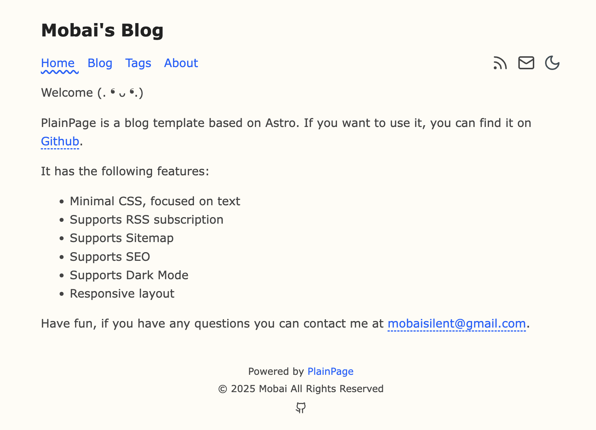
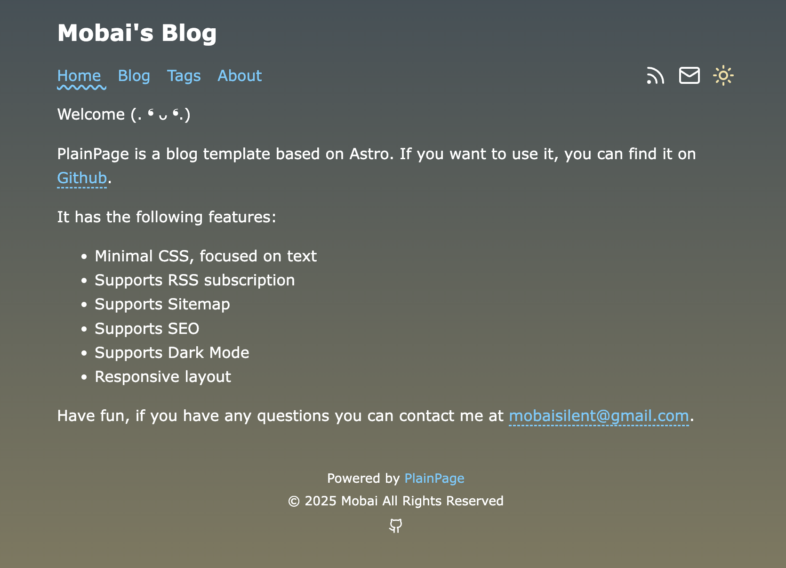

<div align="center">
  
</div>

# PlainPage

一个快速、注重文本、极简主义的博客系统。

这里是PlainPage的个性化修改，具体参考原作者的仓库和模版。⛄️

## 在线演示

[Demo](https://blog.loliowo.com)

## 特点

- 🚀 快速：100% 静态，无服务器端渲染
- 📖 简单：仅使用 Markdown 文件
- 🌈 可定制：自定义主题和布局
- 📚 SEO友好：支持搜索引擎优化
- 📱 响应式：支持移动设备
- 📦 基于最新版本的 [Astro](https://astro.build)

## ✅ Lighthouse 评分

[](https://pagespeed.web.dev/analysis/https-churchtao-github-io-PlainPage/e1mpmv9swy?form_factor=desktop)

## 截图




## 🚀 项目结构

```text
├── public/                # 静态资源文件夹，用于存放公共的静态文件，如图片、字体等，最终直接部署到站点根目录。
├── src/                   # 源代码文件夹，存放项目的核心代码和逻辑。
│   ├── components/        # 组件文件夹，用于存放可复用的 UI 组件。
│   ├── content/           # 内容文件夹，用于存放站点的内容数据，如 Markdown 文件或其他静态内容。
│   ├── layouts/           # 布局文件夹，用于存放页面的布局组件。
│   ├── pages/             # 页面文件夹，存放网站的页面入口，每个文件会对应一个路由。
│   └── consts.ts          # 常量文件，定义全局的常量或配置数据。
├── astro.config.mjs       # Astro 配置文件，用于配置项目的编译选项、插件等。
├── README.md              # 项目说明文件，提供项目的基本信息、使用方法和开发指南。
├── package.json           # 项目依赖和脚本配置文件，包含 npm 包和命令定义。
└── tsconfig.json          # TypeScript 配置文件，用于定义 TypeScript 编译器选项。
```

`src/content/` 目录包含相关 Markdown 和 MDX 文档的"集合"。使用 `getCollection()` 从 `src/content/blog/` 检索文章，并使用可选的模式对前置元数据进行类型检查。查看 [Astro 的内容集合文档](https://docs.astro.build/en/guides/content-collections/) 了解更多信息。

任何静态资源（如图片）都可以放在 `public/` 目录中。

所有配置都在 `src/consts.ts` 中。

```ts
// src/consts.ts

// 网站配置
export const SITE_TITLE = "PlainPage";
export const SITE_DESCRIPTION = "Welcome (. ❛ ᴗ ❛.)";
export const COPYRIGHT = "© 2024 PlainPage All Rights Reserved";
export const ICP_NUMBER = "";

// 社交媒体链接, 留空或注释=不显示
export const SOCIAL_LINKS = {
  Github: "https://github.com/yourGithub",
  //   Twitter: "https://twitter.com/yourusername",
  //   LinkedIn: "https://www.linkedin.com/in/yourusername",
  //   Instagram: "https://www.instagram.com/yourusername",
  //   Facebook: "https://www.facebook.com/yourusername",
  //   YouTube: "https://www.youtube.com/yourusername",
};

// SEO 相关
export const SEO_CONFIG = {
  ogImage: "/hero-img.png", // 默认的社交媒体分享图片
  keywords: "blog, tech, programming", // 默认关键词
};

// 导航配置
export const NAV_ITEMS = [
  { text: "Home", link: "/" },
  { text: "Blog", link: "/blog" },
  { text: "Tags", link: "/tags" },
  { text: "About", link: "/about" },
];

// 博客配置
export const BLOG_CONFIG = {
  locale: "en-us", // 日期格式化语言
  authorName: "Author Name", // 作者名称
  email: "mailto:your-email@example.com",
  tags: {
    title: "Tags", // 标签页面标题
    description: "All the tags used in posts.", // 标签页面描述
  },
};
```
## 🧞 命令

所有命令都在项目根目录的终端中运行：

| 命令                      | 操作                                           |
| :------------------------ | :----------------------------------------------- |
| `npm install`             | 安装依赖                                        |
| `npm run dev`             | 在 `localhost:4321` 启动本地开发服务器          |
| `npm run build`           | 构建生产站点到 `./dist/` 目录                   |
| `npm run preview`         | 在部署前本地预览构建                            |
| `npm run astro ...`       | 运行 CLI 命令，如 `astro add`、`astro check`    |
| `npm run astro -- --help` | 获取 Astro CLI 使用帮助                         |

## 致谢

本主题基于 [Bear Blog](https://github.com/HermanMartinus/bearblog/)。

灵感来自 [satnaing/astro-paper](https://github.com/satnaing/astro-paper)。

派生自 [PlainPage](https://github.com/ChurchTao/PlainPage) 。

基于 [Astro](https://astro.build) 构建。

## 使用本主题的站点

- [毛桃的小世界](https://毛桃.top)
- [Mobai's Blog](https://blog.loliowo.com)

👏 你可以通过创建 PR 来将你的站点添加到列表中。

## 📜 许可证

基于 [MIT](./LICENSE) 许可证，版权所有 © 2024